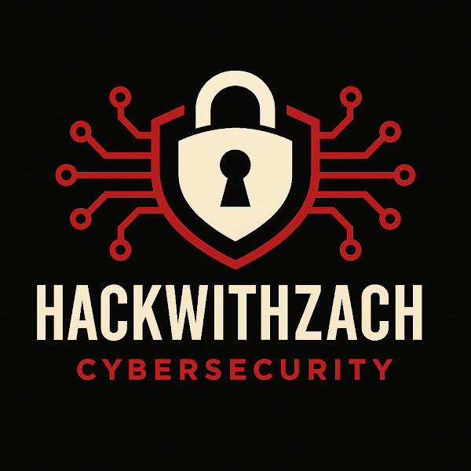

<p align="center">
  
</p>

<h1 align="center">Cloud and AI Security Engineer: From Zero to Hired</h1>
<p align="center">Cybersecurity Education That Gets You Hired, Promoted and Paid.</p>
<p align="center"><em>Build it. Release it. Break it. Harden it.</em></p>

---

> FULL COHORT MATERIAL. This repository is licensed to enrolled HackWithZach Full cohort members only. It is not part of the Light tier. Do not share, post, or redistribute it. See `LICENSE.md`.

## What this repo is

The complete build repository for the Cloud and AI Security Engineer program. You build the whole system yourself, one module at a time. You do not read about security here. You prove it with your own hands.

## The format of every project and pillar

Every project and pillar in this program, cloud and AI alike, follows the same four steps. This is the standard. Do not expect a finished secure system handed to you. You build the insecure one and fix it yourself.

1. Deploy the insecure stack. The code is explained, so you understand how it works and why it is insecure.
2. Run the scan script to identify the insecure structure. You can run it as many times as you want, and the code is explained so you understand exactly how it detects each problem.
3. Run the fix script to remediate the findings. Repeatable and idempotent, and the code is explained so you understand exactly how each fix works.
4. Run the same scan script from step 2 again. Every check now passes.

Two guarantees hold for every project. Everything is explained, in a `LESSON.md` and in commented scripts. And everything is validated before you touch AWS: each project's scan and fix scripts ship with an offline `--selftest` that proves the fix closes exactly what the scan flags, so you are never running unproven code against your account.

Everything lives under the program folder:

```
Cloud-and-AI-Security-Engineer/
  module-01-cloud-foundation/     <- start here
  ...more modules added as the program runs
```

## Read these first

- `DISCLAIMER.md` before you deploy anything. Educational use, sandbox accounts only, you own the costs.
- `SECURITY.md` for the no-secrets rules and the pre-commit secret scan.
- `LICENSE.md` for what you may and may not do with this material.

## Turn on the secret scan (once per clone)

```bash
git config core.hooksPath .githooks
```

## Program modules

| Module | Folder | Status |
|---|---|---|
| 1. The Cloud Foundation | `Cloud-and-AI-Security-Engineer/module-01-cloud-foundation` | Ready |
| 2. API Security on the foundation | | Coming |
| 3. Observability and Detection | | Coming |
| 4. Pillar 1: LLM Security | | Coming |
| 5. Pillar 2: AI APIs and MCP | | Coming |
| 6. Pillar 3: Agentic AI | | Coming |
| 7. Pillar 4: Vibe Coding | | Coming |
| 8. Capstone: all pillars, one foundation | | Coming |

## Start now

```bash
cd Cloud-and-AI-Security-Engineer/module-01-cloud-foundation
# read README.md, then TEACH.md, then follow RUNBOOK.md
```

---

By Zach Marcy. Cybersecurity Architect and Mentor. 20+ years in IT, 6 in cybersecurity. I design and secure cloud environments that deploy and secure APIs and AI.

© 2026 Vigilantia Technologies INC. All rights reserved. "HackWithZach" and the HackWithZach logo are trademarks of Vigilantia Technologies INC.
